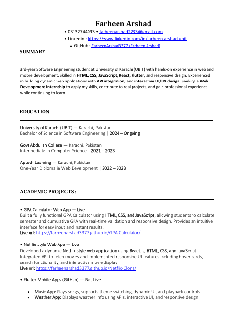
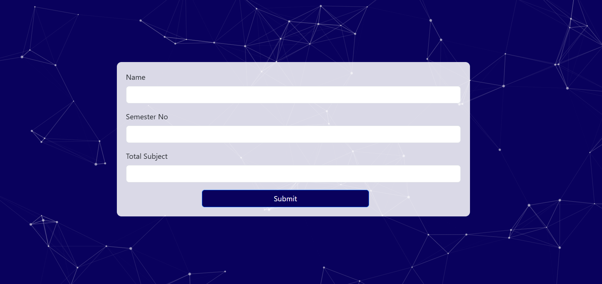

Perfect! I can help you create a **professional, clean, and detailed README** for your portfolio repo. I’ll include:

* Project title & description
* Live demo link
* Tech stack
* Features (resume download, projects, social links)
* Screenshots
* How to run locally

Here’s a solid draft for your `README.md`:

---

````markdown
# Farheen Arshad Portfolio

Welcome to my **personal portfolio website**! This is a showcase of my skills, projects, and professional experience as an **undergraduate Software Engineering student**. The portfolio is fully responsive, built with **React.js**, **JavaScript**, **HTML**, **CSS**, **Bootstrap**, and deployed on **GitHub Pages**.

🔗 **Live Demo:** [https://farheenarshad3377.github.io/farheen-portfolio/#/](https://farheenarshad3377.github.io/farheen-portfolio/#/)

---

## 🛠️ Tech Stack

- **Frontend:** React.js, HTML5, CSS3, Bootstrap 5  
- **Libraries & Tools:** React-Bootstrap, React Icons, Typewriter Effect, React Parallax Tilt, React PDF  
- **Deployment:** GitHub Pages

---

## ✨ Features

1. **Resume Section**  
   - View your resume directly in the portfolio.  
   - Download resume as a PDF file.

2. **Projects Showcase**  
   - Highlights my web development projects with images and live links (where applicable).  
   - Each project card includes a short description of tech used and functionality.

3. **Social Media Links**  
   - Easily accessible links to my GitHub, LinkedIn, Instagram, and other platforms.  
   - Interactive icons with hover effects.

4. **Responsive Design**  
   - Works seamlessly on desktop, tablet, and mobile devices.  
   - Clean, modern, and user-friendly interface.

---

## 📸 Screenshots

**Home Section**  


**Resume Section**  


**Projects Section**  


---

## 🚀 Getting Started Locally

1. Clone the repository:

```bash
git clone https://github.com/FarheenArshad3377/farheen-portfolio.git
````

2. Navigate to the project folder:

```bash
cd farheen-portfolio
```

3. Install dependencies:

```bash
npm install
```

4. Run locally:

```bash
npm run dev
```

5. Open [http://localhost:5173](http://localhost:5173) to view the portfolio.

---

## 📄 Resume

* Click on the **Resume** section to view your professional resume.
* Download the PDF directly from the portfolio.

---

## 💻 Projects

* Each project has a card displaying:

  * Project image
  * Tech stack used
  * Brief description

* Example projects include:

  * Movie App
  * Travel App
  * Music App
  * Weather App
  * Restaurant App

---

## 🔗 Social Links

* [GitHub](https://github.com/FarheenArshad3377)
* [LinkedIn](https://www.linkedin.com/in/farheen-arshad-61b663282/)
* [Instagram](https://www.instagram.com/flutterhive37)

---

## 📌 Author

**Farheen Arshad**
Undergraduate Software Engineering Student | Web & Mobile Developer

---

## 📜 License

This project is **open-source** and available for personal and educational use.

```

---

If you want, I can also **enhance this README with badges** for technologies, download button for resume, and a **live GIF preview** of your portfolio — that will make it look really professional on GitHub.  

Do you want me to do that next?
```
